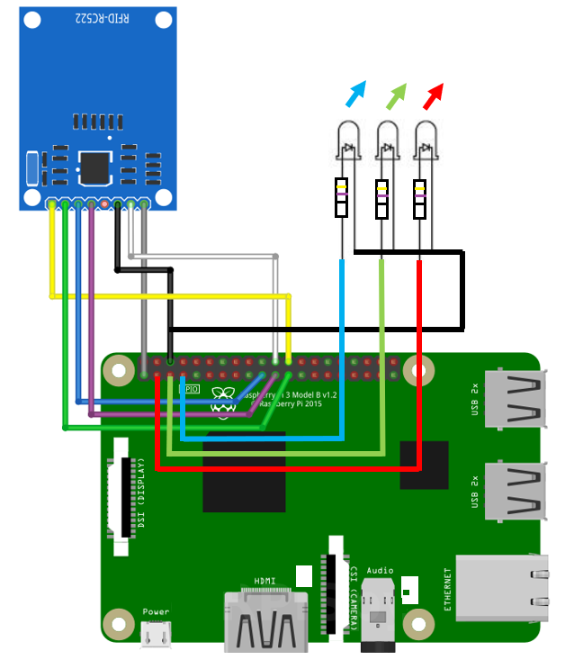

# DUO MFA for RFID authentication

This demo is an example of how we can integrate DUO Secondary Authentication into a RFID Tag based Authentication application which runs on a raspberry PI.

The Raspberry PI waits for a RFID Tag scanning ( for any kind of purpose ). When the user scans his badge the DUO MFA is triggered and he has to confirm authentication on his mobile phone.

What you need for this demo is :

- A raspberry PI 3B
- A RFID-RC522  NFC Card Reader
- A Tri-color LED ( RGB ) or 3 separate Leds
- 3 resistors ( 270 ohms or 470 ohms )

All these component are very easy to buy and are very cheap

## Connect the RFID-RC522 and LEDs to the Raspberry PI

## Install the Raspberry PI OS

There is a lot of tutorials on the INTERNET which explain how to install raspbian OS into a SD Card. I let you use one of these.

And here are the important steps to go thru after having installed the OS on your Raspberry PI

### Enable SPI

- sudo raspi-config

And enable SPI under the [ Interfacing Options ] section.

### Upgrade and Update

- sudo apt-get update
- sudo apt-get upgrade 

### Install GIT client and Python PIP

- sudo apt-get -y install git python-pip

### Install RFID Software

Check if the SPI module is loaded 

- lsmod | grep spi

You should see something like :

 spidev			16384 
 spi_bcm2835 	16384
 
### Install needed python package 
 
- sudo apt-get install python2.7-dev

### Download RC522 Python Library

- cd /home/pi
- git clone https://github.com/pimylifeup/MFRC522-python.git

### Test the reader

At this point you should be able to test the Reader.

copy all python scripts into the [ /home/pi ] folder in your Raspberry PI.

Run the <b>0_read.py</b> script and Scan one of the RFID Tag you got with the RFID-RC522 reader.

- cd /home/pi
- python 0_read.py

You should get a result. You will see the TAG ID.

If you see the TAG ID, then you are ready to go

Run the <b>1_write.py script</b>  and then write a user name into your RFID Tag, and use the same username as the one you use into your DUO account.

- python 1_write.py

But at this point you can write anything.

Check that you succeeded to write your username into the tags.  ( Run again the 0_read.py script )

### RFID Tag reading loop example

Let's see an example of loop which waits for tags to be scanned, and which will output cards IDs of scanned TAGs and which will wait again for another TAG tobe scanned

- python 2_nfc_read_loop.py

CTRL+C to exit.

OK...We are ready to add DUO MFA to this.

## Setup the DUO MFA Demo
The goal now is to, on top the previous steps, to setup a DUO Client demo.

A user scans his RFID Tag, and then he is definitely authenticated thanks to DUO MFA Authentication.

### Import the duo_client python module

- pip install duo_client

Edit the script named python <b>3_duo_rfid.py</b>

This script is ready to run. It manages for You DUO APIs and Leds On/Off.  Have a look at it.

And set the correct values for  ikey, skey, akey and host.

And obviously your DUO account must be ready to run the Demo.

To make the demo work, you must have a DUO account and you must already have gone thru steps 1 to 3 of the DUO WEB documentation https://duo.com/docs/duoweb

You will find there how to generate ikey,skey,akey and host into your DUO Account

If Done, we are ready to test !!

Run the script :

- <b>python 3_duo_rfid.py</b>

And <b>CTRL+C</b> to exit

- When the script starts the Blue Led moves to ON ( waiting for TAGs )
- When a TAG is scanned , the led blinks PINK and stays PINK during DUO MFA. DUO MFA is triggered and you should get the Pushed Authentication message on your Phone.
- If you accept the Authentication the LED will first blink Green and will stay Green ON a few seconds before moving back to Blue ON ( waiting for new scans )
- If you reject the Authentication the LED will be Red instead of Green.

Here we go !!

Remark : the script fails if you try to scan a tags without username... I let you fix that
